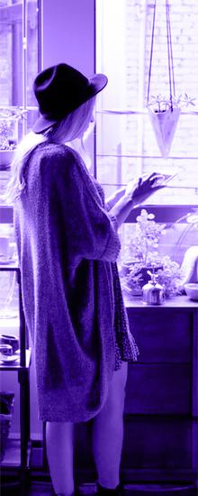
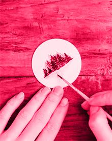
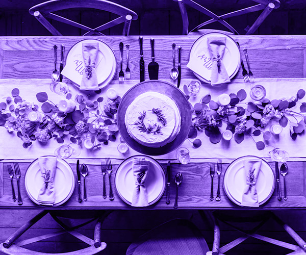
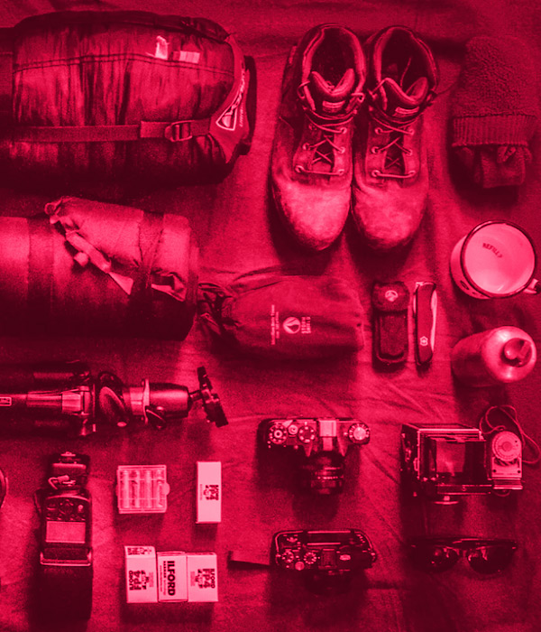
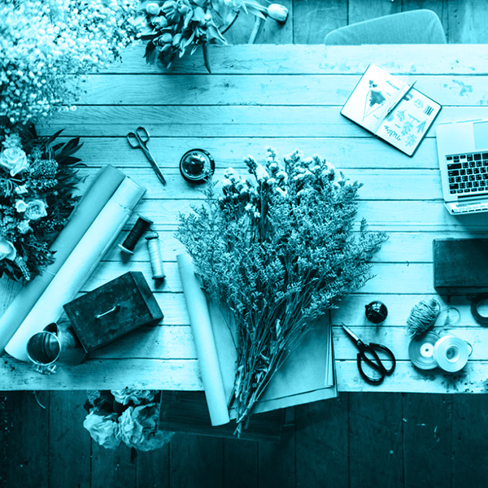

<h1 align="center">
  📰 FlexBlog
</h1>

<p align="center">
  Landing page responsiva construída para praticar <strong>Flexbox</strong> e as novas propriedades de CSS, como parte do curso de Flexbox da <a href="https://www.origamid.com/" target="_blank">Origamid</a>.
</p>

<p align="center">
  
  
  
  
</p>

<p align="center">
  <a href="#-sobre-o-projeto">Sobre</a> •
  <a href="#-preview">Preview</a> •
  <a href="#-funcionalidades">Funcionalidades</a> •
  <a href="#-tecnologias">Tecnologias</a> •
  <a href="#-estrutura-do-projeto">Estrutura</a> •
  <a href="#-como-executar">Como executar</a> •
  <a href="#-aprendizados">Aprendizados</a> •
  <a href="#-autor">Autor</a>
</p>

<br>

## 📖 Sobre o projeto

O **FlexBlog** é um layout de página única (landing page) desenvolvido inteiramente com **HTML5** e **CSS3**, utilizando **Flexbox** como principal ferramenta de layout. O projeto simula o site de um blog/e-commerce, contendo seções de introdução, sobre, produtos, planos de preço, qualidades e newsletter, todas responsivas e adaptadas para diferentes tamanhos de tela.

O objetivo principal foi consolidar o domínio do modelo Flexbox — `flex-wrap`, `flex-grow`, `flex-shrink`, `flex-basis`, `align-items`, `justify-content`, entre outras propriedades — além de explorar boas práticas com **variáveis CSS (custom properties)** e **media queries**.

## 🖼 Preview

<p align="center">
  
  
</p>

<p align="center">
  
  
  
</p>

> 💡 As imagens acima ilustram os elementos visuais utilizados nas seções **Sobre** e **Produtos** do projeto.

## ✨ Funcionalidades

- ✅ Header fixo com informações de contato e navegação por âncoras
- ✅ Seção **Sobre**, com texto e imagens organizados via Flexbox
- ✅ Seção **Produtos**, com cards coloridos por categoria (Purple, Pink, Blue)
- ✅ Seção **Preços**, com três planos (Cobre, Prata, Ouro) e reordenação por `order` em telas menores
- ✅ Seção **Qualidade**, com destaque cíclico de cores via `:nth-child`
- ✅ Formulário de **Newsletter**
- ✅ Layout 100% responsivo, construído com `flex-wrap` e media queries
- ✅ Uso extensivo de variáveis CSS (`:root`) para cores e bordas reutilizáveis

## 🚀 Tecnologias

Este projeto foi desenvolvido com as seguintes tecnologias:

- [HTML5](https://developer.mozilla.org/pt-BR/docs/Web/HTML)
- [CSS3](https://developer.mozilla.org/pt-BR/docs/Web/CSS) (Flexbox, Custom Properties, Media Queries)
- [Google Fonts](https://fonts.google.com/specimen/Nunito) — fonte *Nunito*
- [Adobe Photoshop](https://www.adobe.com/products/photoshop.html) — arquivo de design (`flexblog.psd`)

## 📂 Estrutura do projeto

```
flexblog/
├── assets/
│   └── images/
│       ├── flexblog.psd
│       ├── produtos1.jpg
│       ├── produtos2.jpg
│       ├── produtos3.jpg
│       ├── sobre1.jpg
│       └── sobre2.jpg
├── components/
│   └── css/
│       └── style.css
└── index.html
```

## 🔧 Como executar

Por ser um projeto estático (sem dependências ou build), basta:

```bash
# Clone este repositório
git clone https://github.com/gabrielfelipeoliveira55/FlexBlog.git

# Acesse a pasta do projeto
cd FlexBlog

# Abra o arquivo index.html no seu navegador de preferência
```

Ou utilize a extensão **Live Server** do VS Code para uma experiência com recarregamento automático.

## 🎓 Aprendizados

Durante o desenvolvimento deste projeto, os principais pontos praticados foram:

- Construção de layouts complexos e responsivos sem a necessidade de frameworks CSS
- Uso combinado de `flex-grow`, `flex-shrink` e `flex-basis` para controlar o comportamento dos elementos
- Reordenação visual de elementos com a propriedade `order`
- Organização de estilos com variáveis CSS para manter consistência visual
- Boas práticas de acessibilidade, como `aria-label` e `rel="noopener noreferrer"` em links externos

## 👨‍💻 Autor

Desenvolvido por **Gabriel Felipe de Oliveira Rateiro**

[](https://github.com/gabrielfelipeoliveira55)

Design original por **André Rafael**, fundador e dono da [Origamid](https://www.origamid.com/).

---

<p align="center">
  Projeto desenvolvido durante o curso de <strong>Flexbox</strong> da <a href="https://www.origamid.com/curso/css-flexbox/" target="_blank">Origamid</a> 🚀
</p>